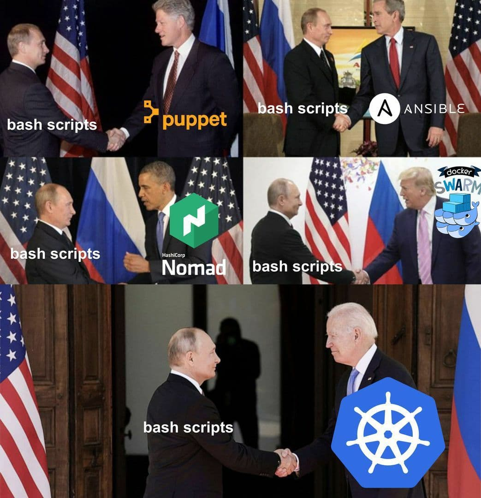
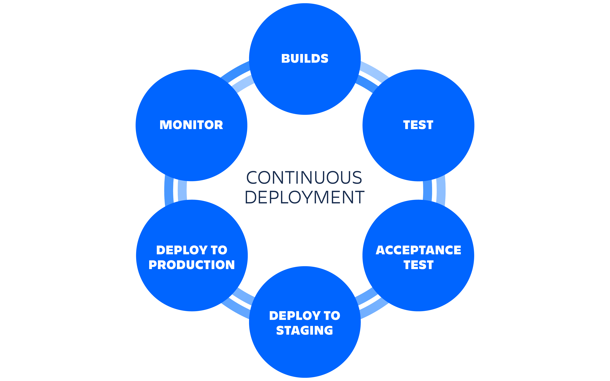
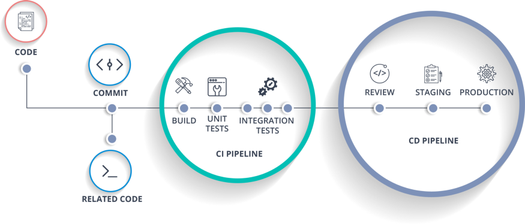
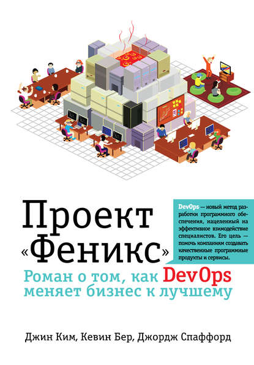
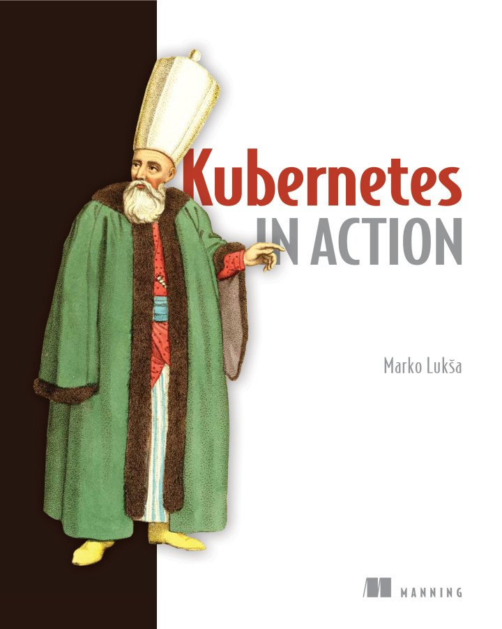

<style>
  section {
  width: 100%;
  height: 100vh;
  position: relative;
  background-color: #f6faff;
  color: black;
  font-family: Arial, Helvetica, sans-serif;
  font-size: 30px;
  padding: 40px;
}

footer {
  position: absolute;
  bottom: 40px;
}

h1,
h2 {
  text-align: center;
  margin: 0;
}
</style>

# Цель лекции

* Узнать, что такое Devops, CI/CD, Deploy
* Познакомиться с новыми полезными инструментами (Vagrant, Ansible)
* Научиться использовать новые инструменты и практики

---

# Новые инструменты

* Vagrant
* Ansible
* Github Actions, Gitlab CI
* Heroku

---

# Зачем нужно знать

* Код выполняется в разных средах - прод, тестовая, разработка (предсказуемость)
* Разработка ведется коллективо (эффективность)
* Важно получать фидбек как можно раньше (безопасность)

---

# Vagrant

* Инструмент для быстрого развертывания окружения для разработки на основе систем виртуализации.
* Виртуализация - Vmware, VirtualBox, Hyper-v
* Инфраструктура как код (Vagrantfile)

<!--
Инфраструктура как код (англ. Infrastructure-asCode; Iac) Это подход для управления и описания инфраструктуры
через конфигурационные файлы
 -->

---

# Vagrant

```sh
vagrant up # - создает виртуальную машину
vagrant halt # - останавливает виртуальную машину
vagrant destroy # - удаляет виртуальную машину
vagrant suspend # - "замораживает" виртуальную машину
vagrant global-status # - выводит список всех ранее созданных виртуальных машин в хост-системе
vagrant ssh # - подключается к виртуальной машине по SSH
```

---

# Vagrantfile

```ruby
Vagrant.configure("2") do |config|

  config.vm.box = "base"
  config.vm.network "private_network", ip: "192.168.33.10"

  config.vm.provider "virtualbox" do |vb|
    vb.memory = "1024"
  end
  config.vm.provision "shell", inline: <<-SHELL
    apt-get update
    apt-get install -y apache2
  SHELL
end
```

---

# Vagrant

## Зачем нужен, если есть Docker?

* Девелоперская машина с рабочим окружением
* Временная тестовая среда для экспериментов
* Поднять машину на другой ОС/архитектуре (Ubuntu, Centos, FreeBSD, Windows)
* Поднять инфраструктуру (веб-сервера, балансеры, база)

<!--
https://github.com/fey/dotfiles
https://github.com/fey/infrastructure-experiments

http://www.vagrantbox.es/
https://app.vagrantup.com/boxes/search
-->

---

# Управление конфигурацией

<!--
https://guides.hexlet.io/configuration-management/

Новая машина содержит только основную операционную систему с небольшим набором предустановленных программ. Перед тем как запустить на ней какой-то сервис, например, обычный сайт, понадобится установить дополнительные пакеты. Набор пакетов зависит от стека технологий, на котором он написан. Если сайт “завернут” в Docker, то настройка значительно упрощается и сводится к установке самого Docker. В остальных случаях придется потратить какое-то время на донастройку и конфигурирование. Помимо пакетов, часто требуется настраивать саму систему, менять конфигурационные файлы, права на файлы и директории, создавать пользователей и так далее:
-->

  ```sh
  # Заходим на удаленную машину (Сервер на Ubuntu)
  ssh root@ipaddress

  # Создание пользователя для деплоя. Где-то здесь копируются ssh ключи
  sudo adduser deploy

  sudo apt install curl
  # установка Node.js
  curl -fsSL https://deb.nodesource.com/setup_16.x | sudo -E bash -
  sudo apt install nodejs
  # установка и настройка Nginx
  sudo apt install nginx
  vim /etc/nginx/default.conf

  # Формирование структуры директорий для сервиса
  mkdir -p /opt/hexlet/versions/
  ```

---

# Автоматизация настройки сервера

## Bash-скрипты

```sh
# Копирование на сервер с помощью scp
scp mybashscript.sh root@ipaddress:~/

# Заходим на сервер и запускаем скрипт
ssh root@ipaddress
sh ~/mybashscript.sh
```



---

# Автоматизация настройки сервера

## Bash-скрипты

<!-- Если перенести команды в bash-скрипт “как есть”, без модификации, то, скорее всего, нам придется постоянно следить за выводом и не забывать подтверждать установку пакетов, так как это поведение по умолчанию
Другая проблема серьезнее, она связана с понятием “идемпотентность”. Что будет если выполнить команду создания директории два раза?
Команда завершится с ошибкой, она не идемпотентна. То есть последовательные вызовы одной и той же команды приводят к разному результату. Идемпотентность для настройки сервера очень важна. Иначе повторный запуск скрипта настройки завершится с ошибкой. А повторные запуски нужны, например в случае отладки самого скрипта, когда мы его только пишем и проверяем как он работает. В случае с командой mkdir идемпотентности добиться легко, достаточно добавить флаг -p:
-->

```sh
# # Скрипт останавливается и ждет ответа
➜  ~ apt install golang
The following additional packages will be installed:
  golang-1.13 ...
After this operation, 329 MB of additional disk space will be used.
Do you want to continue? [Y/n]
apt install -y golang
# будет ошибка
mkdir /hexlet
mkdir /hexlet # ?
# ошибки не будет
mkdir -p /hexlet
mkdir -p /hexlet
```

---

# Идемпотентность

Идемпотентность — это свойство, которое команда развертывания всегда задает целевую среду в той же конфигурации независимо от состояния запуска среды.

<!--
https://docs.microsoft.com/ru-ru/devops/deliver/what-is-infrastructure-as-code
-->

---

# Ansible

* Автоматизировать процесс настройки локального окружения и удаленных серверов
* Автоматизировать процесс сборки, деплоя
* Инфраструктура как код
* Обеспечивает идемпотентность

---

# Ansible

```sh
ansible             ansible-console     ansible-inventory   ansible-pull
ansible-config      ansible-doc         ansible-lint        ansible-vault
ansible-connection  ansible-galaxy      ansible-playbook
```

```makefile
install:
	ansible-galaxy install -r requirements.yml

ping:
	ansible -i inventory.yml all -m ping

deploy:
	ansible-playbook playbook.yml -i inventory.ini --vault-password-file vault-password
```

<!--
https://github.com/fey/dotfiles
https://github.com/fey/devops-for-programmers-project-lvl2
https://galaxy.ansible.com/
-->

---

# Continuous integration


<!--
https://www.atlassian.com/ru/continuous-delivery/continuous-integration
-->

---

# Continuous integration

* Непрерывная интеграция (CI) - это практика автоматизации интеграции изменений кода от нескольких авторов в единый программный проект.
* В основе процесса CI лежит система контроля версий исходного кода.
* Без CI возниает избыточная коммуникация. Необходимость координировать действия и договариваться при внесении изменений
* С использованием CI цикл релизов может сократиться (деплой несколько раз в день)
* Улучшение цикла обратной связи

---

# Continuous integration

## Инструменты для CI

* Github Actions
* Gitlab CI
* Jenkins

---

# Continuous integration

## Github Actions

* *.github/workflows/<workflow_name>.yml*
* Бесплатно для открытых репозиториев
* Есть Экшены - готовые скрипты
* Подходит для различных учебных и пет-проектов

<!--
https://github.com/Hexlet/hexlet-sicp
https://github.com/Hexlet/hexlet-cv/blob/master/.github/workflows/push.yml
https://github.com/hexlet-boilerplates/php-package/blob/master/.github/workflows/workflow.yml
-->

---


# Continuous integration

## Gitlab CI

* Конфиг для CI берется из *.gitlab-ci.yml*
* Позволяет использовать шаблоны
* Можно развернуть на своей инфраструктуре

<!--
https://gitlab.com/feycot/xsolla-summer-school-backend-2021
[](examples/ci/gitlab/ci-cd-capistrano-gitlab-ci.yml)
[](examples/ci/gitlab/ci-docker-gitlab-ci.ymll)
-->

---

# Деплой

Деплой – процесс “разворачивания” веб-сервиса, например, сайта, в рабочем окружении. Рабочее окружение – место где сайт запускается и доступен для запросов.

1. Код проекта скачивается на сервер (обычно через клонирование Git)
1. Ставятся все необходимые зависимости
1. Выполняется процесс сборки, например собирается фронтенд-часть
1. Выполняются миграции. Миграции — SQL-скрипты, которые изменяют структуру базы данных
1. Запускается новая версия кода

<!--
https://guides.hexlet.io/deploy/
-->

---

# Деплой

## Зачем автоматизировать?

* Нужно заходить на сервер
* Перезапуск сервисов
* Иногда нужно откатывать миграции
* Можно реализовать различные стратегии деплоя
* Zero downtime deployment

---

# Средства автоматизации деплоя

* Capistrano, Deployer
* Ansible ([deploy_helper](https://docs.ansible.com/ansible/latest/collections/community/general/deploy_helper_module.html#examples), [ansistrano](https://github.com/ansistrano/deploy))
* Docker, Kubernetes
* CI tools

<!--
https://github.com/ansistrano/deploy
-->

---

# Стратегии деплоя

* Recreate - просто убиваем старую версию, запускаем новую
* Ramped (rolling-update or incremental) - Старая версия постепенно заменяется новой
* Blue/Green - новая версия живет вместе старой. Потом старая отключается
* Canary - часть  трафика уходит на новую версию
* A/B testing - деление трафика по определенному признаку
* Shadow - дублирование трафика на новую версию без влияния на основное приложение

<!--
https://thenewstack.io/deployment-strategies/
-->

---


---

# Continuous Deployment

Непрерывное развертывание (CD) - это процесс выпуска ПО, который использует автоматизированное тестирование для проверки правильности и стабильности изменений в кодовой базе для немедленного автономного развертывания в производственной среде.



---

# CI/CD Pipeline



---

# А куда деплоить?

* Shared hosting
* Clouds
* Github Pages
* Remote server

---
# Heroku

* Бесплатно для для маленьких проектов
* Можно подключить домен
* Можно подключить базу, редис и тд
* CLI для управления приложением


---

# Digital Ocean

* Создание чистых или преднастроенных машин (С докером, приложениями)
* Создание базы данных, кластеров Kubernetes
* Парковка домена
* При регистрации по [ссылке](https://m.do.co/c/e702f9a99145) выдают 100$ на 60 дней

---

# Devops

DevOps - методология взаимодействия разработчиков, тестировщиков, специалистов эксплуатации, представителей бизнеса-направления

* Патрик Дебуа
* Джон Оллспоу и Пол Хэммонд
* [10-plus deploys per day: dev and ops cooperation at Flickr](https://www.youtube.com/watch?v=LdOe18KhtT4)

<!--
История начинается в Бельгии 2007-ого с парня по имени
Патрик Дебуа. У Патрика была интересная цель: он хотел
изучить IT со всех сторон. Патрик был консультантом, но
выбирал вакансии так, чтобы поработать в каждой IT отрасли
Перейдём к 2009 году, когда Джон Оллспоу и Пол Хэммонд
вместе работали во Flickr. 23 июня на O'reilly’s Velocity
Сonference в Сан-Хосе они представили свой ныне знаменитый
доклад «10-plus deploys per day: dev and ops cooperation at Flickr»
-->

---

# Итоги

* Узнали, что такое Devops, CI/CD, Deploy
* Познакомились с новыми полезными инструментами (Vagrant, Ansible)

### Задание

Применить полученные знания на практике. Добавить CI/CD, автоматизировать деплой на вашем тестовом проекте

---

# Литература

* "Цель. Процесс непрерывного совершенствования" Элияху Голдратт
* "Проект «Феникс». Роман о том, как DevOps меняет бизнес к лучшему" Джин Ким, Джордж Спаффорд, Кевин Бер
* "Kubernetes в действии" Лукша Марко





---

# Ссылки

* Гайды - https://guides.hexlet.io/
* Ansible - https://www.ansible.com/
* [Никита Соболев — Автоматизируем все с Github Actions](https://www.youtube.com/watch?v=QoCSvwkP_lQ)
* [Инфраструктура как код](https://www.youtube.com/watch?v=m_5sos7i1Qk)
* [Вебинар: Stateful vs. Stateless ](https://www.youtube.com/watch?v=WPCz_U7D8PI)
* [Интервью с Алексеем Шараповым: о микросервисах](https://www.youtube.com/watch?v=OeUzjV6wPlc)
